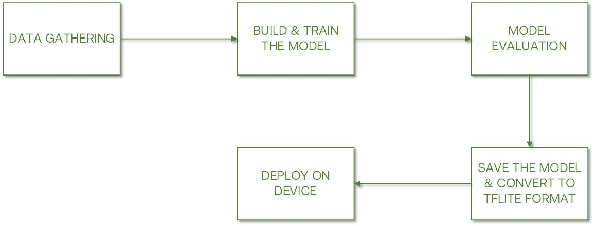
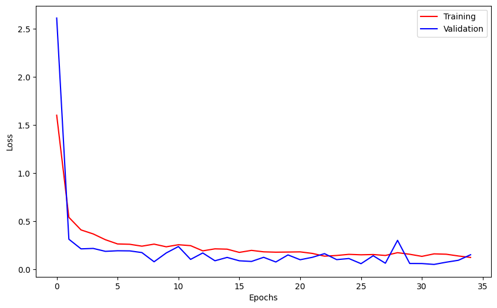
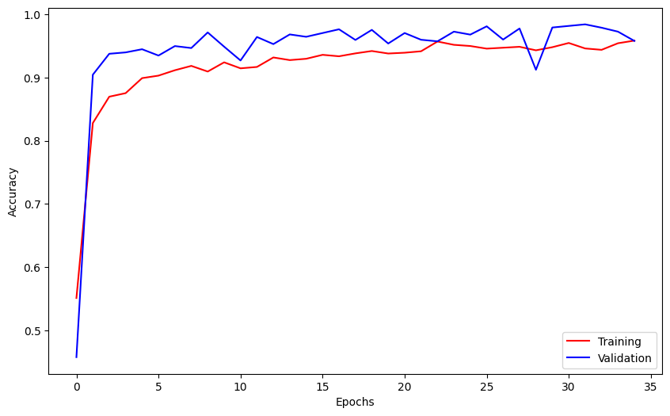
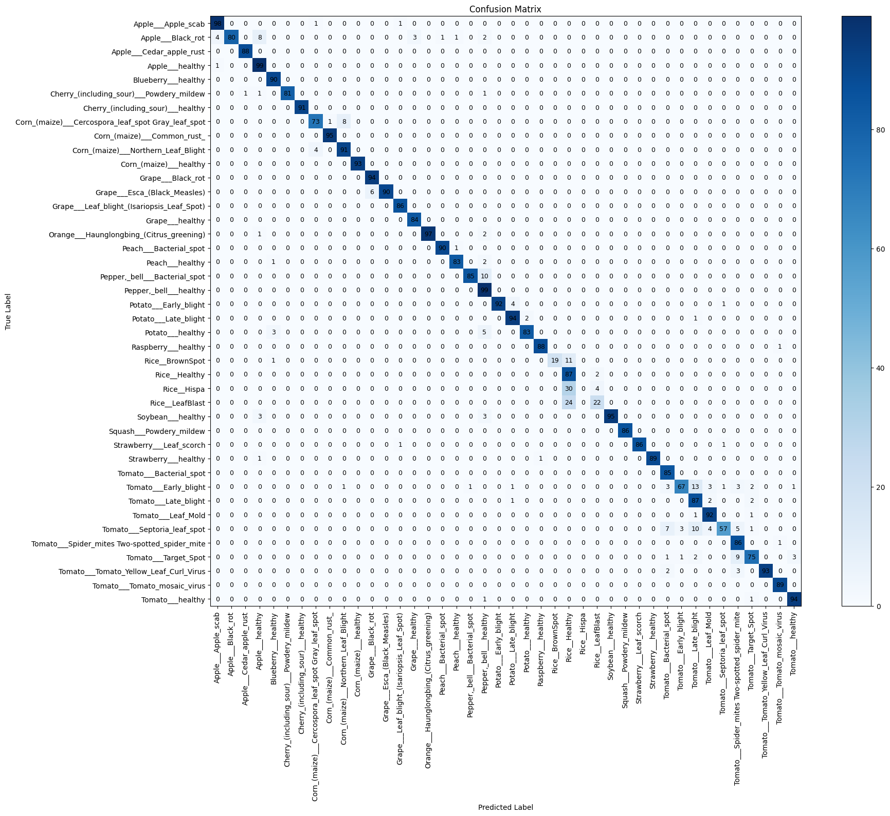

# Plant disease classification with pre-trained model : MobileNet
A plant disease classification developed with the combination of the New Plant Diseases Dataset and Rice leaf images dataset. We used the pre-trained model: MobileNet.
* Test accuracy : 93.24%
## Dataset
* [New plant diseases](https://www.kaggle.com/datasets/vipoooool/new-plant-diseases-dataset)
* [Rice leaf images](https://www.kaggle.com/datasets/nizorogbezuode/rice-leaf-images)
## Environment and Tools
1. Jupyter Notebook
2. Tensorflow
3. Keras
4. Numpy
5. Scikit-learn
## Work Flow

## Loss vs Epoch

## Accuracy vs Epoch

## Confusion Matrix

## Contributed by - Machine Learning student :
* [Shanty](https://www.linkedin.com/in/shanty01/) - Machine Learning Student - <code>M169DSY1532</code>
* [Fajra Hanifa Nuridi Radam](https://www.linkedin.com/in/fajra-hanifa-nuridi-radam-0798b3219/) - Machine Learning Student - <code>M229DSY0026</code>
